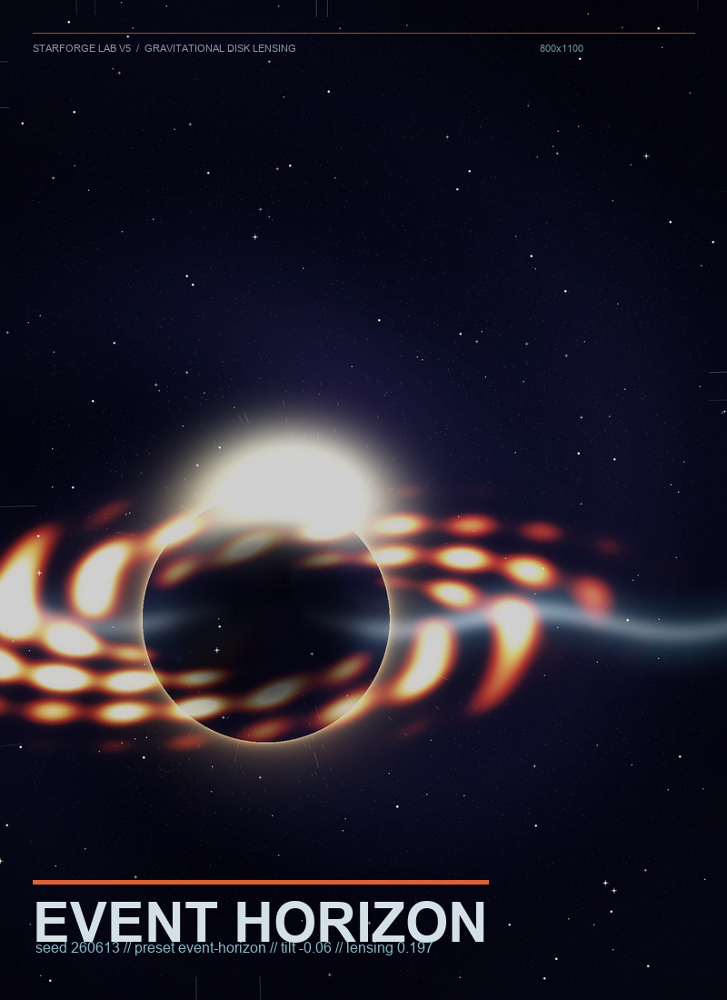
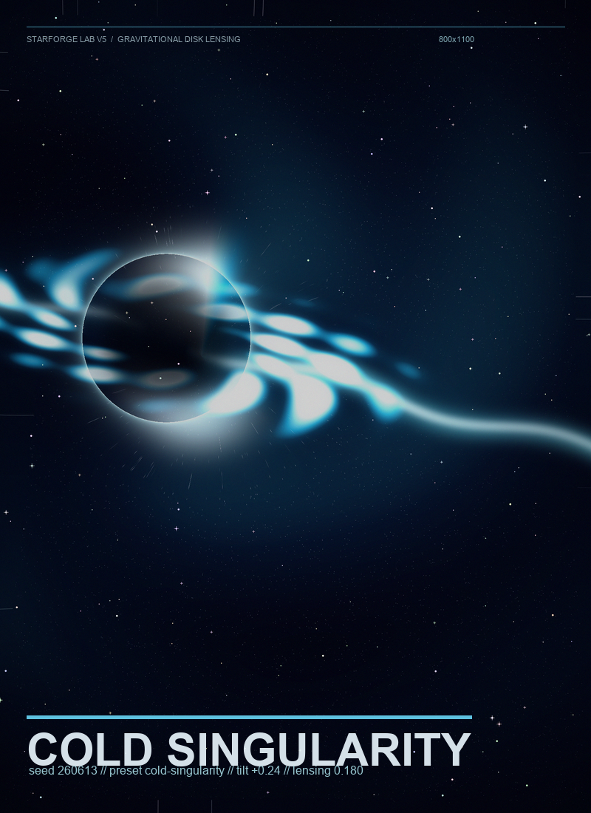
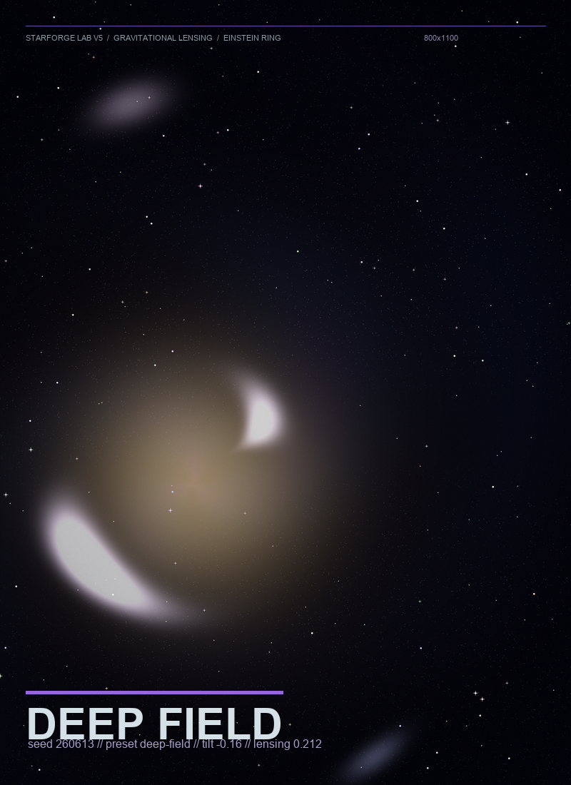

# starforge lab

most procedural art demos stop right before they become an artifact. and the seed is usually just noise.

starforge lab is a deterministic python art machine for gravitational lensing. the seed drives real structure, not noise: position, tilt, banding, horizon size, lensing strength, palette temperature. it sweeps seeds and presets, scores them with inspectable composition metrics, exports a ranked collection, and renders a final poster plus animation/video. a good render is reproducible from its seed, not lucky.

## gallery

three sample renders, each reproducible from its seed, not picked from a noise lottery:

| black-hole / event-horizon | black-hole / cold-singularity | lensed-galaxy / deep-field |
| --- | --- | --- |
|  |  |  |

## subjects

two subjects, picked with `--subject`:

- `black-hole` (default): an accretion disk whose far side lenses up over the shadow, with an emergent photon ring.
- `lensed-galaxy`: a foreground elliptical galaxy that bends a background galaxy field into Einstein rings and arcs.

both run on the same deterministic single-center lensing math. the black-hole path is byte-identical to v4.

## what v4 added

the black hole actually lenses now. the far side of the accretion disk bends up over the top of the shadow and curls beneath it (the Interstellar / EHT look), and the photon ring emerges from the light bending piling up at the photon sphere instead of being drawn by hand. it stays deterministic numpy. no ray tracer, no gpu.

curation got split out from generation. the renderer is the source of truth and stays reproducible; a separate curator only ranks candidates, so a smarter ranker can drop in later without changing how a render is made.

## output

- `index.html` - local gallery for the finished release
- `starforge_poster.png` - high-resolution poster render
- `starforge.gif` - animated accretion disk preview
- `starforge.mp4` / `starforge.webm` - cinematic loops, written through `ffmpeg`
- `seed_gallery.png` - scored candidate seed sweep
- `collection_gallery.png` - ranked top-k across every preset
- `starforge_contact_sheet.png` - sampled animation frames
- `manifest.json` - preset, source seed, selected seed + genome, dimensions, curator, videos, dependency versions, asset list

## run it

```bash
PYTHONDONTWRITEBYTECODE=1 PYTHONPATH=. python3 -m starforge.cli \
  --output ../../outputs/starforge \
  --width 1600 --height 2200 \
  --frames 48 \
  --seed 260613 \
  --preset neon-collapse \
  --batch 10 --top-k 6 \
  --supersample 2 \
  --video --scale-preview
```

installed as a console script too: `starforge --output release --seed 260613 ...`

for a lensed galaxy, add `--subject lensed-galaxy` (try `--preset deep-field` or `solar-wound`).

## presets

| preset | feel |
| --- | --- |
| `event-horizon` | classic gold-black gravity well |
| `neon-collapse` | magenta, cyan, and hot accretion streaks |
| `cold-singularity` | blue-white, colder and sharper |
| `solar-wound` | aggressive orange solar tear |
| `deep-field` | purple deep-space survey plate |

## tweak points

| knob | effect |
| --- | --- |
| `--seed` | starting point for the seed sweep |
| `--subject` | `black-hole` (default) or `lensed-galaxy` |
| `--preset` | visual colour system and rendering weights |
| `--seed-gallery` | candidates to score before the final render (single preset) |
| `--batch` / `--top-k` | sweep across all presets, keep the best k |
| `--curator` | how candidates get ranked (default `heuristic`) |
| `--width`, `--height` | poster dimensions |
| `--frames` | animation length |
| `--supersample` | poster supersampling (1-3), poster only |
| `--video` | writes mp4/webm when `ffmpeg` is available |
| `--scale-preview` | keeps animation/video/contact sheet smaller while the poster stays full size |

## test it

```bash
PYTHONDONTWRITEBYTECODE=1 PYTHONPATH=. pytest -p no:cacheprovider -v
```

## inspect a release

```bash
python3 tools/inspect_outputs.py ../../outputs/starforge
```
