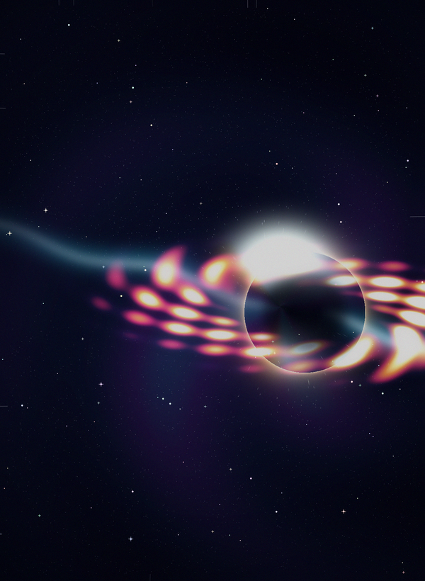
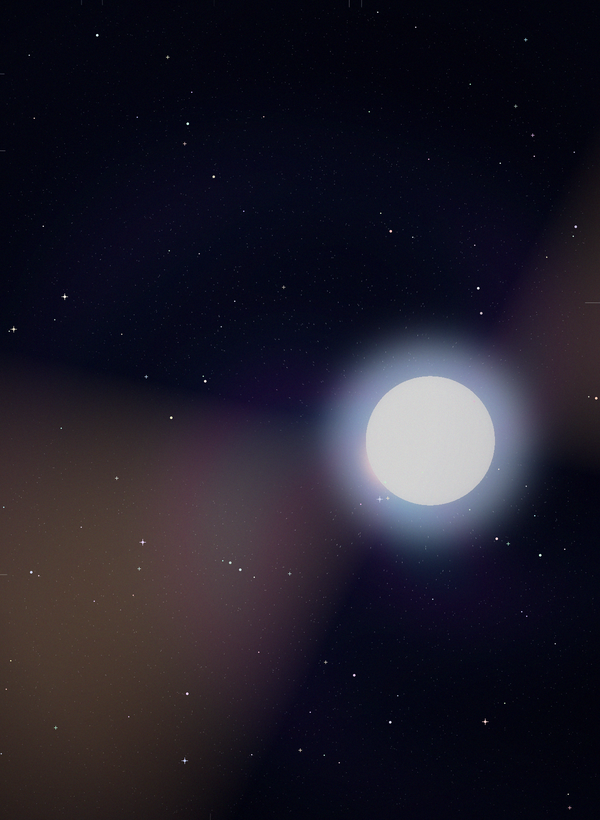
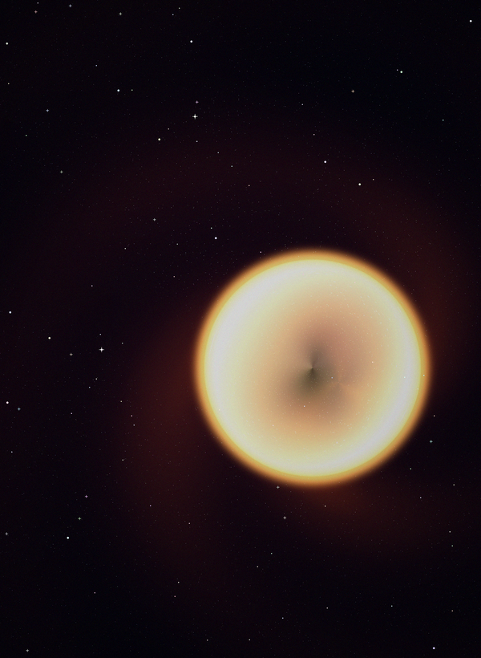

<div align="center">

# ✦ STARFORGE LAB ✦

### a deterministic art machine for gravitational lensing

**every frame is reproducible from a single integer.**
no noise lottery. no cloud. no GPU. no luck.


<br>



<sub>`starforge --seed 260613 --preset neon-collapse` — and it will look exactly like this on your machine too</sub>

</div>

---

## the part that's actually hard

most procedural art demos stop right before they become an artifact. and the "seed" is usually just noise: change it and you get a different smear of the same thing.

starforge is the opposite bet. the seed drives **real structure** — position, tilt, banding, horizon size, lensing strength, palette temperature — and the lensing is **real closed-form physics**, not a hand-drawn ring. it sweeps seeds and presets, scores each one with inspectable composition metrics, keeps the best, and renders a final poster plus a seamless animation.

then it does the thing nobody bothers with: **a good render is reproducible from its seed, down to the byte.** same seed, same preset, same size → the same pixels, every run, forever. that property is tested, locked, and treated as sacred.

> it's a 1,900-line python lab. numpy does the math, pillow writes the frames. that's the whole stack.

---

## ✦ four subjects, one lensing engine

pick with `--subject`. all four run on the same deterministic single-center lensing math.

<table>
<tr>
<td width="50%" align="center">
<br>
<b>★ black hole</b><br>
<sub>an accretion disk whose far side bends <i>up and over</i> the shadow, with a photon ring that emerges from the light bending itself — the Interstellar / EHT look</sub>
</td>
<td width="50%" align="center">
<br>
<b>★ lensed galaxy</b><br>
<sub>a foreground elliptical that warps a background galaxy field into Einstein rings and arcs — the Hubble deep-field look</sub>
</td>
</tr>
<tr>
<td width="50%" align="center">
<br>
<b>★ neutron star</b><br>
<sub>a compact hot surface with two magnetic-pole hotspots and twin lighthouse beams that sweep as the star spins — and the sweep loops seamlessly</sub>
</td>
<td width="50%" align="center">
<br>
<b>★ wormhole</b><br>
<sub>a strong throat lens that pulls a <i>different universe</i> into the mouth, ringed by an Einstein ring where the two skies meet</sub>
</td>
</tr>
</table>

each new subject draws its structure from a **separate RNG stream**, so adding one never shifts the locked black-hole genome. the black-hole path is byte-identical to v4.

---

## ✦ it's real lensing, not a gradient

the black hole genuinely bends light. closed-form, frame-invariant, precomputed once per render — no ray tracer, no GPU.

| piece | what it does |
| --- | --- |
| `build_deflection_lut` | tabulates the bending angle vs impact parameter — a strong-deflection log divergence at the photon sphere blended into the weak-field tail |
| `sample_emergent_ring` | the photon ring **emerges** from that divergence piling up at the photon sphere, instead of being drawn by hand |
| `build_disk_fold_map` | the gravitational fold that lays the disk's far side as a bright arc over the top of the shadow and curls a dimmer copy beneath |
| `build_einstein_lens_map` | a singular-isothermal-sphere lens (`β = θ − θ_E · θ̂`) — the same gather powers the galaxy's Einstein rings and the wormhole's throat |

> the disk's secondary arc is the disk's *own emission*, re-gathered through the fold. the colour and texture stay consistent because it's the same light, bent.

---

## ✦ reproducible to the byte

this is the flex, and it's enforced, not claimed:

- **one entropy source.** a single integer seed. no global RNG anywhere — three explicit, non-overlapping streams (genome, subject structure, per-frame grain).
- **a locked draw order.** the genome's RNG sequence is pinned by a golden test. any new field must be drawn *after* the existing sequence, or CI catches the re-roll instantly.
- **a pixel golden.** small renders for every subject are hashed and pinned, so a deterministic-but-wrong visual change can't sneak through.
- **a stable-hash salt.** the preset salt is hand-rolled, not python's `hash()`, because `hash()` is randomized per process and would break reproducibility across machines.

```
seed ──▶ genome (locked draws) ──▶ renderer (LUTs + fold, built once) ──▶ frames
                                                                            │
        scoring ◀── curator ranks ◀──────────────────────────────────────┘
            │
            └──▶ best seed + preset ──▶ poster · gif · mp4 · webm · gallery · manifest
```

generation is the single source of truth. the **curator only ranks** — so a smarter ranker can drop in without ever touching how a render is made.

---

## ✦ run it

```bash
# the black-hole release: sweep, score, pick the best, render the poster + loop
starforge \
  --output release \
  --width 1600 --height 2200 \
  --frames 48 --seed 260613 \
  --preset neon-collapse \
  --batch 10 --top-k 6 \
  --supersample 2 \
  --video --scale-preview
```

```bash
# a wormhole, ranked by the focal-subject curator
starforge --output release-wh --seed 909 --preset solar-wound --subject wormhole --batch 10 --curator studio

# sweep EVERY subject and rank a mixed gallery
starforge --output release-mix --seed 260613 --batch 12 --top-k 6 --cross-subject
```

no install needed — run it straight from the source tree:

```bash
PYTHONDONTWRITEBYTECODE=1 PYTHONPATH=. python3 -m starforge.cli --output release --seed 260613 --batch 10
```

---

## ✦ presets

| preset | feel |
| --- | --- |
| `event-horizon` | classic gold-black gravity well |
| `neon-collapse` | magenta, cyan, and hot accretion streaks |
| `cold-singularity` | blue-white, colder and sharper |
| `solar-wound` | aggressive orange solar tear |
| `deep-field` | purple deep-space survey plate |

---

## ✦ every knob

| flag | effect |
| --- | --- |
| `--seed` | the starting point for the seed sweep |
| `--subject` | `black-hole` (default), `lensed-galaxy`, `neutron-star`, or `wormhole` |
| `--preset` | the visual colour system and rendering weights |
| `--seed-gallery` | candidates to score before the final render (single preset) |
| `--batch` / `--top-k` | sweep across all presets, keep the best k |
| `--cross-subject` | sweep every subject too and rank a mixed collection |
| `--curator` | `heuristic` (contrast-led) or `studio` (rewards a clear focal subject) |
| `--width`, `--height` | poster dimensions |
| `--frames` | animation length |
| `--supersample` | poster supersampling, 1-3 (poster only) |
| `--video` | write mp4 + webm loops when `ffmpeg` is available |
| `--scale-preview` | keep the animation small while the poster stays full size |

---

## ✦ what comes out

a complete, self-contained release directory:

| file | what |
| --- | --- |
| `index.html` | a local lab page for the finished release |
| `starforge_poster.png` | the high-resolution poster |
| `starforge.gif` | the animated loop preview |
| `starforge.mp4` / `.webm` | cinematic loops, written through `ffmpeg` |
| `seed_gallery.png` | the scored candidate sweep |
| `collection_gallery.png` | the ranked top-k across every preset (and subject) |
| `manifest.json` | seed, selected genome, dimensions, curator, dependency versions, provenance |

---

## ✦ poke at it

```bash
# run the full regression suite (69 tests, determinism locked)
PYTHONDONTWRITEBYTECODE=1 PYTHONPATH=. pytest -p no:cacheprovider -v

# validate a generated release
python3 tools/inspect_outputs.py release
```

after an *intended* visual change, re-bless the pixel golden:

```bash
PYTHONPATH=. python3 tools/regen_pixel_golden.py
```

---

<div align="center">

**built on numpy + pillow. runs on your machine, offline, every time.**

*architecture in [ARCHITECTURE.md](ARCHITECTURE.md) · where it's headed in [ROADMAP.md](ROADMAP.md) · history in [CHANGELOG.md](CHANGELOG.md)*

</div>
